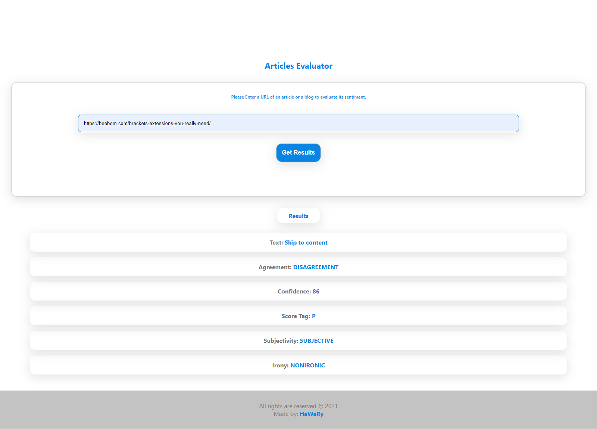

# Articles Evaluator

Articles Evaluator is a web tool that allows you to run Natural Language Processing (NLP) on articles or blogs found on other websites. It depends on the API of MeaningCloud website.

> NLP is the ability of an application to understand the human language, written or oral.

 

## Demo

> Run the Express Server & the Development Server

https://user-images.githubusercontent.com/69651552/134088581-b46ca171-84a5-486f-bf77-967df0554c4b.mp4

> Try the App on localhost:8080

https://user-images.githubusercontent.com/69651552/134088575-66fb9eda-adb1-4f51-b69c-4a4bb6cbfbc4.mp4

## Instructions, Building & Get Started 
 
    - 1- Fork, clone or download this repository to your local machine.
    - 2- Be sure that you install the Node.js environment in your machine.
    - 3- Open your terminal and be sure that you are inside the correct destination of the App, while you must be in the same path of the package.json file.  
    - 4- Create a (.env) file and add the following environment variables into it:

		```
		MEAN_CLOUD_API_URL="Add here the MeaningCloud base URL"
		MEAN_CLOUD_API_KEY="Add here the MeaningCloud API Key"
		```
    - 5- Inside your terminal run these commands:-
    
        * to install dependencies.
        ```
        npm install
        ```
        * to start the Express Node.js server @ port 8081
        ```
        npm run start
        ```
        * to start the development server @ port 8080
        ```
        npm run build-dev
        ```
        * to build the app and get a final production version
        ```
        npm run build-prod
        ```
        * to run the unit testing with jest into the app
        ```
        npm run test
        ```
    - 6- Once the App development server is running, visit (localhost:8080) in the browser to view the App and now you can treat with it as shown above in the Demo.

## Built with

* HTML
* CSS
* Vanilla JS

## Plugins

* [Webpack Dev Server](https://webpack.js.org/configuration/dev-server/)
* [Dotenv](https://www.npmjs.com/package/dotenv-webpack)
* [Clean Webpack Plugin](https://www.npmjs.com/package/clean-webpack-plugin)
* [Optimize Css Assets Webpack Plugin](https://www.npmjs.com/package/optimize-css-assets-webpack-plugin)
* [Terser Webpack Plugin](https://www.npmjs.com/package/terser-webpack-plugin)
* [Mini Css Extract Plugin](https://www.npmjs.com/package/mini-css-extract-plugin)
* [Workbox Webpack Plugin](https://www.npmjs.com/package/workbox-webpack-plugin)
* [Html Webpack Plugin](https://www.npmjs.com/package/html-webpack-plugin)
* [Node Sass](https://www.npmjs.com/package/node-sass)
* [Jest](https://jestjs.io/)

## Loaders

* [Babel Loader](https://www.npmjs.com/package/babel-loader)
* [Sass Loader](https://www.npmjs.com/package/sass-loader)
* [Style Loader](https://www.npmjs.com/package/style-loader)
* [Css Loader](https://www.npmjs.com/package/css-loader)

## Pre-processors

* [SASS](https://sass-lang.com/)

## Compilers

* [Babel](https://babeljs.io/)

## Build Tools

* [Webpack](https://webpack.js.org/)

## API

* [MeaningCloud](https://www.meaningcloud.com/) 

## Dependencies 

* [Body Parser](https://www.npmjs.com/package/body-parser)
* [CORS](https://www.npmjs.com/package/cors)

## Environment  

* Node JS with Express Framework to create server-side for storing the retrieved data

## Notices & Overview about the App

- This App is a practical project from Udacity Course [Nanodegree Program - Web Development Advanced Track](https://www.udacity.com/course/intro-to-programming-nanodegree--nd000)

- The App depends on the NLP (Natural Language Processing) technology to evaluate any text, articles or blogs, using an API from the (MeaningCloud) platform. This platform provides to the developers using its (NLP) technology through its API's. 

- Natural Language Processing leverages machine learning and deep learning create a program that can interpret natural human speech.

- Natural language processing (NLP) is a subfield of computer science, information engineering, and artificial intelligence, concerned with the interactions between computers and human (natural) languages, in particular how to program computers to process and analyze large amounts of natural language data. You could spend years and get a masters degree focusing on the details of creating NLP systems and algorithms.

- NLP on Human Voice: 
  --------------------
  * For example, everyone who has used Alexa or Google Assistant or other voice command systems knows that these devices are always improving, by collecting and interpreting voice data. Verbal interactions can be incredibly hard to decipher. Sarcasm, for instance, requires understanding not just words and grammar but the tone as well, and regional accents and ways of saying things have to be taken into account, not to mention coverage for all the major languages.

- NLP on Text
  ---------------------
  * An example is Grammarly editing tool, which parses the text that you write, and suggests if the tone is professional or not. Another example is the Smart Compose feature for Gmail that uses NLP to suggest words and statements based on your current context.

## Certificate

[Course Certificate](Certificate.pdf)

## Author

* [Mohamed Elhawary](https://www.linkedin.com/in/mohamed-elhawary14/) 

## Contact me through my social accounts

* Email: mohamed.k.elhawary@gmail.com
* [Linkedin](https://www.linkedin.com/in/mohamed-elhawary14/)
* [Github](https://github.com/Mohamed-Elhawary)  
* [Behance](https://www.behance.net/mohamed-elhawary14)
* [Codepen](https://codepen.io/Mohamed-ElHawary)

## License

Licensed under the [MIT License](LICENSE).